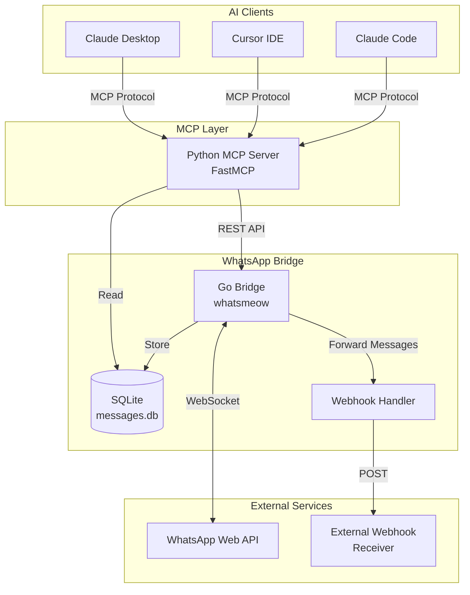
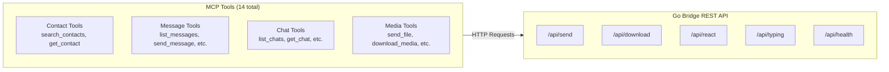
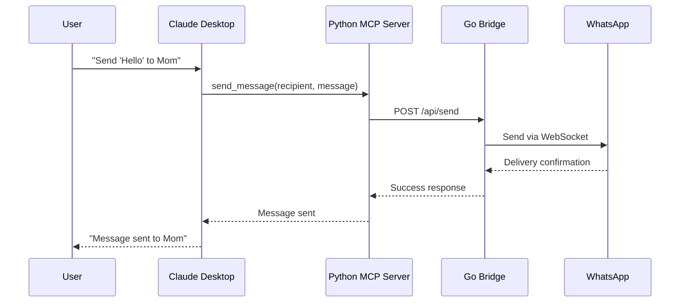
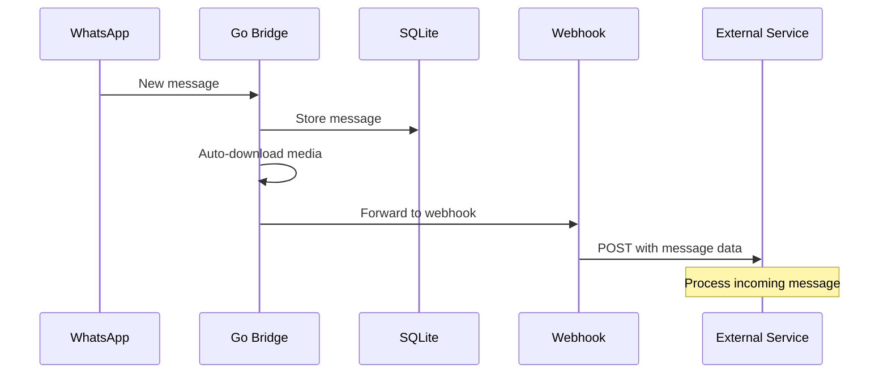

# WhatsApp Digest

[](https://opensource.org/licenses/MIT)
[](https://www.python.org/downloads/)
[](https://go.dev/)

**Too many WhatsApp groups. Updates landing across every channel, all day. Endlessly scrolling back through threads and hopping between chats so you don't miss the one message that actually mattered — that's WhatsApp burnout. This is our answer.**

WhatsApp Digest collapses all your noisy groups into **one channel with the key information only** — your own "message yourself" chat. An LLM reads every group and produces **scheduled digests that combine what matters across all your channels** into a single summary, then **keeps those summaries current in real time** — revising an entry in place as plans change, instead of leaving you to reconcile a dozen threads yourself. It's self-hosted: everything runs on your own machine and your messages never leave it.

## How it works

Two pipelines ship as a self-contained package in [`alerter/`](alerter/):

- **Scheduled AI digests** that merge the key information from all your groups into one summary — grouped, deduped, high-signal, no chatter.
- **Live-updating summaries** — as new messages land, an LLM updates the shared ledger behind the digest, so a changed time / venue / plan revises the existing entry (flagged `(updated)`) instead of adding noise.

The design decision that makes it reliable: the LLM **only extracts structured facts** from messages; the **code** owns memory, de-duplication, and rendering. Every event is one deterministically-keyed record in a ledger, so the digest renders the same way every time instead of drifting. Architecture in [docs/realtime-alerter.md](docs/realtime-alerter.md).

Under the hood the digest layer reads from a WhatsApp [MCP](https://modelcontextprotocol.io/) bridge — a Go service linked to WhatsApp as a companion device, plus a Python MCP server. The bridge also adds document attachments in webhook forwarding and headless **pairing-code login** (`WA_PAIR_PHONE`) for servers with no scannable QR.

**Start here:** the [`alerter/` README](alerter/README.md) covers digest setup. The rest of this document documents the underlying bridge + MCP server the digest runs on.

## Features

- **Message Management**: Search and read personal WhatsApp messages (text, images, videos, documents, audio)
- **Contact Search**: Search contacts by name or phone number with `sender_display` format ("Name (phone)")
- **Send Messages**: Send text messages to individuals or groups
- **Media Support**: Send and download images, videos, documents, and voice messages
- **Call History**: Capture incoming voice/video calls into a local SQLite table (live, 1:1 and group)
- **Webhook Integration**: Forward incoming messages to external services
- **Local Storage**: All messages stored locally in SQLite - only sent to Claude when you allow it

## Installation

This sets up the **bridge** (which links your WhatsApp) and points you at the **digest** (the product). Both run headless on a machine you control — a VM, home server, or Pi. Claude Desktop / Cursor are **optional** and only needed if you also want to query your WhatsApp interactively from an MCP client; the digest itself does not use them.

### Prerequisites

- Go 1.25+
- Python 3.11+
- [uv](https://docs.astral.sh/uv/) package manager
- FFmpeg (optional, for voice message conversion)
- Claude Desktop or Cursor (optional — interactive use only)

### Quick Start

1. **Clone the repository**

   ```bash
   git clone https://github.com/raoulbia-ai/whatsapp-digest.git
   cd whatsapp-digest
   ```

2. **Start the WhatsApp bridge**

   ```bash
   cd whatsapp-bridge
   go run .
   ```

   On first start, the bridge prints and stores a local REST API token at
   `whatsapp-bridge/store/.bridge-token`. Scan the QR code with WhatsApp on
   your phone to authenticate. On a headless server with no scannable QR, use
   pairing-code login via `WA_PAIR_PHONE`.

3. **Set up the digest** — this is the product.

   Follow the [`alerter/` README](alerter/README.md) to configure scheduled
   digests and live-updating summaries. It runs headless (systemd timers + the
   `claude` CLI); no desktop app is involved.

## Tools

Messages include `sender_display` showing "Name (phone)" format for easy identification by agents.

### Contact Operations

#### `search_contacts`

Search contacts by name or phone number.

**Parameters:**

- `query` (required): Name or phone number to search

**Natural Language Examples:**

- "Find contacts named John"
- "Search for phone number 555-1234"
- "Who has the phone number starting with +1?"

#### `get_contact`

Resolve a WhatsApp contact name from a phone number, LID, or full JID.

**Parameters:**

- `identifier` (required): Phone number, LID, or full JID (aliases: `phone_number`, `phone`)
  - Examples: `12025551234`, `184125298348272`, `12025551234@s.whatsapp.net`, `184125298348272@lid`

**Natural Language Examples:**

- "What's the name for phone number 5551234567?"
- "Look up who owns this number"
- "Who is 184125298348272@lid?"

### Message Operations

#### `list_messages`

Get messages with filters, date ranges, and sorting.

**Parameters:**

- `chat_jid` (optional): Filter by specific chat JID
- `limit` (optional): Number of messages (default 50, max 500)
- `before_date` (optional): Messages before this date (YYYY-MM-DD)
- `after_date` (optional): Messages after this date (YYYY-MM-DD)
- `sort_by` (optional): "newest" or "oldest" (default "newest")

**Natural Language Examples:**

- "Show me the last 100 messages from today"
- "Get messages from the family group chat"
- "Find messages from last week"

#### `send_message`

Send a text message to a contact or group, optionally as a quoted reply.

**Parameters:**

- `recipient` (required): Phone number or group JID
- `message` (required): Text content to send
- `quoted_message_id` (optional): ID of the message to reply to. When provided, the sent message appears as a quoted reply in WhatsApp.
- `quoted_sender_jid` (optional): Full JID of the author of the quoted message. Required for group replies so WhatsApp renders the correct attribution header.
- `quoted_content` (optional): Text content of the quoted message, used for the reply preview. Only plain text is supported.

Inbound quoted replies are stored automatically. The `quoted_message_id` field in each message returned by `list_messages` indicates which message it is replying to (or `null` for non-replies).

**Natural Language Examples:**

- "Send 'Hello!' to +1234567890"
- "Message the team group saying 'Meeting at 3pm'"
- "Reply to that message saying 'Sounds good'"

#### `send_reaction`

Send (or remove) an emoji reaction to a message.

**Parameters:**

- `recipient` (required): Chat JID the message belongs to (phone JID or group JID)
- `message_id` (required): ID of the message to react to
- `emoji` (required): Reaction emoji (e.g. `"👍"`). Pass an empty string `""` to remove an existing reaction.
- `from_me` (optional, default `false`): Whether the original message was sent by the current user
- `sender_jid` (optional): Full JID of the original message sender — required for group messages when `from_me` is `false` so the correct WhatsApp key is built

Inbound reactions received from others are stored automatically as messages with `media_type = "reaction"`. The `reaction_to_message_id` field in each reaction message indicates which message was reacted to.

When webhook forwarding is enabled, inbound reactions are also posted to `WEBHOOK_URL` as typed events. Reaction removals use an empty `content`/`reactionEmoji` and `reactionRemoved: true`.

```json
{
  "eventType": "reaction",
  "sender": "15551234567",
  "chatJID": "15551234567@s.whatsapp.net",
  "isFromMe": true,
  "content": "👍",
  "messageId": "reaction-stanza-id",
  "mediaType": "reaction",
  "reactionToMessageId": "target-message-id",
  "reactionEmoji": "👍",
  "reactionRemoved": false
}
```

**Natural Language Examples:**

- "React to that message with a thumbs up"
- "Remove my reaction from the last message in the group chat"

#### `send_file`

Send a media file (image, video, document).

**Parameters:**

- `recipient` (required): Phone number or group JID
- `file_path` (required): Path to the file
- `caption` (optional): Caption for the media

The bridge only reads files inside configured media roots. By default this is
`~/.local/share/whatsapp-mcp/outbox`; set `WHATSAPP_MEDIA_ROOTS` to allow
additional absolute directories.

#### `send_audio_message`

Send a voice message (automatically converts to Opus .ogg format).

**Parameters:**

- `recipient` (required): Phone number or group JID
- `file_path` (required): Path to audio file

Converted audio is sent through the same media-path confinement as
`send_file`.

#### `download_media`

Download media from a received message.

**Parameters:**

- `message_id` (required): ID of the message with media
- `chat_jid` (required): JID of the chat containing the message

### Chat Operations

#### `list_chats`

List all chats with metadata.

**Parameters:**

- `limit` (optional): Number of chats (default 50, max 200)

#### `get_chat`

Get specific chat metadata by JID.

**Parameters:**

- `jid` (required): Chat JID

#### `get_direct_chat_by_contact`

Find a direct message chat with a contact.

**Parameters:**

- `phone` (required): Phone number of the contact

#### `get_contact_chats`

List all chats involving a specific contact.

**Parameters:**

- `phone` (required): Phone number of the contact

#### `get_last_interaction`

Get the last message exchanged with a contact.

**Parameters:**

- `phone` (required): Phone number of the contact

#### `get_message_context`

Get messages around a specific message for context.

**Parameters:**

- `message_id` (required): ID of the target message
- `chat_jid` (required): JID of the chat
- `before` (optional): Number of messages before (default 5)
- `after` (optional): Number of messages after (default 5)

## Configuration

Copy `.env.example` to `.env` and configure as needed:

| Variable               | Default                                  | Description                                  |
| ---------------------- | ---------------------------------------- | -------------------------------------------- |
| `WHATSAPP_BRIDGE_PORT` | `8080`                                   | Port for Go bridge REST API                  |
| `WEBHOOK_URL`          | `http://localhost:8769/whatsapp/webhook` | Webhook for incoming messages                |
| `FORWARD_SELF`         | `true`                                   | Forward messages sent by self                |
| `WHATSAPP_DB_PATH`     | `../whatsapp-bridge/store/messages.db`   | Path to SQLite database                      |
| `WHATSMEOW_DB_PATH`    | `../whatsapp-bridge/store/whatsapp.db`   | whatsmeow DB used for LID ↔ phone resolution |
| `WHATSAPP_API_URL`     | `http://localhost:8080/api`              | Go bridge REST API URL                       |
| `WHATSAPP_BRIDGE_TOKEN` | generated in `whatsapp-bridge/store/.bridge-token` | Bearer token required for bridge REST calls |
| `WHATSAPP_MEDIA_ROOTS` | `~/.local/share/whatsapp-mcp/outbox`     | Path-list of directories allowed for outbound media files |

### Bridge authentication and media paths

The bridge requires bearer-token authentication for every `/api/*` request and
accepts only exact loopback Host headers for its configured port. This protects
the local REST API from other local processes and browser DNS-rebinding attacks.

On first start, the bridge generates a 256-bit token, writes it to
`whatsapp-bridge/store/.bridge-token` with owner-only permissions, and prints a
setup banner. The MCP server reads `WHATSAPP_BRIDGE_TOKEN` first, then falls
back to that token file. For split deployments, containers, or process managers
that do not share the repository directory, set the same
`WHATSAPP_BRIDGE_TOKEN` value for both the bridge and MCP server.

Outbound `media_path` values are confined to `WHATSAPP_MEDIA_ROOTS`. The default
outbox is `~/.local/share/whatsapp-mcp/outbox`, created on bridge startup. Move
files there before calling `send_file` or `send_audio_message`, or set
`WHATSAPP_MEDIA_ROOTS` to a colon-separated list of absolute directories.

### Run automatically on macOS

macOS users can install optional per-user `launchd` jobs that start the Go
bridge at login and monitor it every 60 seconds for API health, disconnects, and
QR relink signals. The installer does not require `sudo` and does not install or
start the MCP server.

```bash
scripts/install-launchd-macos.sh
```

The installer builds `whatsapp-bridge/whatsapp-bridge` with `go build` when Go is
available, writes generated support files to
`~/Library/Application Support/whatsapp-mcp/`, writes LaunchAgents to
`~/Library/LaunchAgents/`, and writes logs to `~/Library/Logs/whatsapp-mcp/`.
It safely reloads only these labels:

- `com.whatsapp-mcp.bridge`
- `com.whatsapp-mcp.bridge-monitor`

To customize the launchd environment, export values before running the installer.
Re-run the installer after changing them.

```bash
export WHATSAPP_BRIDGE_PORT=8080
export WEBHOOK_URL=http://localhost:8769/whatsapp/webhook
export FORWARD_SELF=false
export WHATSAPP_MEDIA_ROOTS="$HOME/.local/share/whatsapp-mcp/outbox"
scripts/install-launchd-macos.sh
```

Verify the jobs and inspect logs:

```bash
launchctl print gui/$(id -u)/com.whatsapp-mcp.bridge
launchctl print gui/$(id -u)/com.whatsapp-mcp.bridge-monitor
tail -n 100 ~/Library/Logs/whatsapp-mcp/bridge.err.log
tail -n 100 ~/Library/Logs/whatsapp-mcp/monitor.err.log
```

The monitor sends a macOS notification once per failure type until recovery. It
alerts when the bridge LaunchAgent is unloaded, the token is missing, the health
endpoint is unreachable, WhatsApp is disconnected, or recent logs indicate that
QR relinking is needed.

Uninstall the generated LaunchAgents and support files with:

```bash
scripts/uninstall-launchd-macos.sh
```

Uninstall preserves `whatsapp-bridge/store/`, including WhatsApp session DBs,
message DBs, media, and `.bridge-token`. Logs are left in
`~/Library/Logs/whatsapp-mcp/` for manual cleanup.

### CLI flags (Go bridge)

| Flag                  | Default | Description                                                                                                                                                                                                                                                       |
| --------------------- | ------- | ----------------------------------------------------------------------------------------------------------------------------------------------------------------------------------------------------------------------------------------------------------------- |
| `--full-history-pair` | `false` | Request full history at pair time. Only takes effect on a fresh pair (no existing `whatsapp.db`); no-op for already-paired sessions. The phone ultimately decides the actual history window sent — see [Requesting full history](#requesting-full-history) below. |

### Requesting full history

whatsmeow's default pairing asks for "recent sync" — roughly the last 3 months, with the exact window decided by the phone. If you want to pull more history at pair time:

```bash
# Stop the bridge
launchctl bootout gui/$UID/com.whatsapp-mcp.bridge    # or however you manage it

# Back up, then remove the auth session (keeps messages.db intact)
cp whatsapp-bridge/store/whatsapp.db{,.bak}
rm whatsapp-bridge/store/whatsapp.db

# Re-pair with the flag
cd whatsapp-bridge
./whatsapp-bridge --full-history-pair
# Scan the QR with WhatsApp → Settings → Linked Devices → Link a Device
# Wait for "History sync complete" in the logs (can take 10-30 minutes)
# Ctrl+C when sync has quiesced, then restart under your normal process manager
```

Caveats:

- **The phone decides the actual cap.** The flag requests up to 10 years / 100 GB, but WhatsApp's iOS primary device enforces its own retention policy. iPad companion is documented at ~1 year max; other linked devices appear to follow similar logic.
- **Only effective on a fresh pair.** With `whatsapp.db` already present, no new pair handshake fires and the flag is a no-op.
- **Messages the phone has deleted are not recoverable** — auto-expire, low-storage cleanup, and manual delete all leave no trace for the phone to share.

## Call History

The bridge captures incoming WhatsApp voice and video calls live into a
dedicated `calls` table in `messages.db`. When a 1:1 call arrives
(`CallOffer`) or a group call is announced (`CallOfferNotice`), a row is
inserted with `result='in_progress'`. Subsequent `CallAccept` /
`CallReject` / `CallTerminate` events update the row — final result becomes
`answered`, `rejected`, `missed`, or `ended` depending on the event
sequence. See the state-machine comment above `StoreCallOffer` in `main.go`
for the exact transitions.

### Schema

```sql
CREATE TABLE calls (
    call_id TEXT,
    chat_jid TEXT,          -- group JID for group calls, call creator JID for 1:1
    from_jid TEXT,          -- JID of whoever started the call
    timestamp TIMESTAMP,    -- call start time
    is_from_me BOOLEAN,
    call_type TEXT,         -- 'voice' or 'video'
    is_group BOOLEAN,
    result TEXT,            -- 'in_progress' | 'answered' | 'ended' |
                            --   'missed' | 'rejected'
    duration_sec INTEGER,   -- computed when the call terminates
    ended_at TIMESTAMP,
    reason TEXT,            -- terminate reason string from whatsmeow
    PRIMARY KEY (call_id, chat_jid)
);
```

### Caveats

- **Outbound calls are not captured.** WhatsApp's primary device handles
  calls it initiates without notifying linked devices, so the bridge never
  sees an event for them.
- **Call results only reflect what the bridge saw.** If the bridge is
  offline when a call happens, the events are lost.
- **1:1 calls default to `call_type='voice'`.** `CallOffer` events don't
  expose media type directly (it's buried in the binary call data). Group
  calls via `CallOfferNotice` include a `Media` field and are recorded
  accurately as voice or video.

## Architecture



### Component Details



### Data Flow



### Incoming Message Flow



## Development

### Running Tests

```bash
cd whatsapp-mcp-server
uv pip install -e ".[dev]"
uv run pytest -v
```

### Linting

```bash
# Python
cd whatsapp-mcp-server
uv run ruff check .
uv run ruff format .

# Go
cd whatsapp-bridge
golangci-lint run
```

### Building

```bash
# Go bridge
cd whatsapp-bridge
go build -o whatsapp-bridge

# Run the binary
./whatsapp-bridge

# During development (avoids stale binaries)
go run .
```

## Troubleshooting

### Authentication Issues

- **QR Code Not Displaying**: Restart the bridge. Check terminal QR code support.
- **Device Limit Reached**: Remove a linked device from WhatsApp Settings > Linked Devices.
- **No Messages Loading**: Initial sync can take several minutes for large chat histories.
- **Out of Sync**: Back up `whatsapp-bridge/store`, then move
  `whatsapp-bridge/store/whatsapp.db` aside and re-authenticate. Keep
  `messages.db` unless you intentionally want to discard local message history.
- **Bridge returns 401 Unauthorized**: Restart the bridge so it creates
  `whatsapp-bridge/store/.bridge-token`, then restart the MCP server. If the MCP
  server cannot read that file, set `WHATSAPP_BRIDGE_TOKEN` to the same value in
  both environments.
- **Bridge returns 403 Forbidden for Host**: Use `WHATSAPP_API_URL` with
  `http://127.0.0.1:<port>/api`, `http://localhost:<port>/api`, or
  `http://[::1]:<port>/api`; custom hostnames and missing ports are rejected.
- **Bridge returns 403 Forbidden for media_path**: Move the file into
  `~/.local/share/whatsapp-mcp/outbox` or add its absolute parent directory to
  `WHATSAPP_MEDIA_ROOTS`.

### App State / LTHash Conflicts

Some WhatsApp account state is managed by whatsmeow in
`whatsapp-bridge/store/whatsapp.db`. If the bridge reports errors like:

```text
SendAppState failed: server returned error updating app state (regular_low):
<error code="409" text="conflict"/>
failed to verify patch v12345: mismatching LTHash
```

then WhatsApp's app-state patch chain for the linked device is out of sync.
This usually affects operations that write chat settings such as archive,
mute, or pin state. Incoming and outgoing messages may still work because
message storage lives separately in `messages.db`.

Known manual resync attempts such as `FetchAppState(..., fullSync=true)` may
still fail on this upstream app-state error class. The practical recovery path
is to reset the whatsmeow session and re-pair:

```bash
# Stop the bridge first.
launchctl bootout gui/$UID/com.whatsapp-mcp.bridge    # or however you manage it

# Back up the whole runtime store.
cp -a whatsapp-bridge/store whatsapp-bridge/store.bak.$(date +%Y%m%d%H%M%S)

# Reset only the whatsmeow session/app-state DB.
mv whatsapp-bridge/store/whatsapp.db whatsapp-bridge/store/whatsapp.db.lthash.bak

# Restart the bridge and scan the new QR code.
cd whatsapp-bridge
./whatsapp-bridge    # or `go run .` during development
```

Do not remove `whatsapp-bridge/store/messages.db` for this recovery unless you
also want to delete the local message archive.

### Windows

Windows requires CGO for go-sqlite3. Install [MSYS2](https://www.msys2.org/) and enable CGO:

```bash
go env -w CGO_ENABLED=1
go run .
```

## Security Notice

> **Caution**: As with many MCP servers, this is subject to [the lethal trifecta](https://simonwillison.net/2025/Jun/16/the-lethal-trifecta/). Prompt injection could lead to private data exfiltration. Use with awareness.

## License

MIT License - see [LICENSE](LICENSE) for details.

## Credits

The WhatsApp Digest layer (`alerter/`) and the bridge changes it relies on are maintained here. The underlying MCP bridge + server are a fork of [lharries/whatsapp-mcp](https://github.com/lharries/whatsapp-mcp) by [Luke Harries](https://github.com/lharries) (via [verygoodplugins/whatsapp-mcp](https://github.com/verygoodplugins/whatsapp-mcp)) — full credit to those authors. MIT-licensed.

## Links

- [MCP Specification](https://modelcontextprotocol.io/)
- [whatsmeow](https://github.com/tulir/whatsmeow) - WhatsApp Web API library for Go
- [FastMCP](https://github.com/jlowin/fastmcp) - Fast Model Context Protocol implementation
